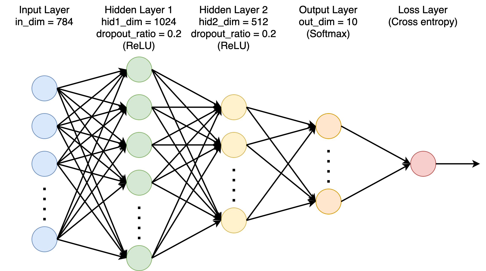
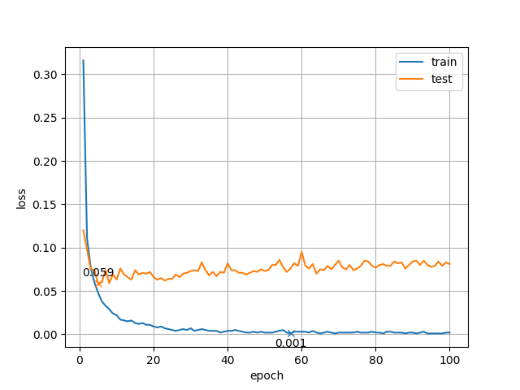
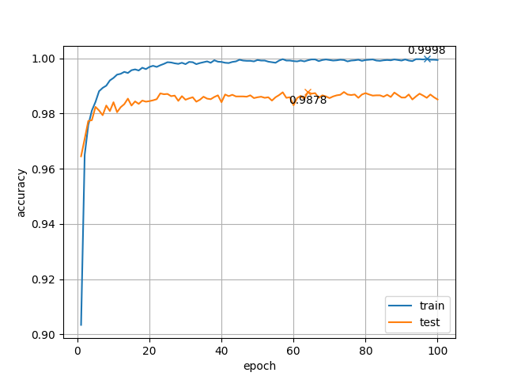

# MLP (多層パーセプトロン)

`MNIST` データセットのテストデータで `98.78 %` の精度を達成する MLP を作成した．

## 構造・パラメータ



上の図のような層を構成した．
活性化関数は ReLU と Sigmoid を実装したが，`ReLU` の方が精度が高くなったので，こちらを採用した．
損失関数は `Cross entropy` (交差エントロピー) を用いた．
オプティマイザは SGD (確率的勾配降下法) と Adam を実装したが，`SGD` の方が最終的な精度は高くなった．
学習率は `lr = 1` とした．

## 動かし方
```bash
$ git clone https://github.com/hashi0203/MLP.git
$ cd MLP
$ pip3 install -r requirements.txt
$ python3 main.py
```

グローンして必要なパッケージをインストールし，実行すればよい．
層の数や活性化関数やオプティマイザなどは `main.py` の中で変更できる．
実行時にデータは自動で data ディレクトリにダウンロードされる．
また，実行が終わると graph ディレクトリの中に loss と accuracy の変化を表すグラフが生成される．

## 実行結果
このようなグラフが生成された．




